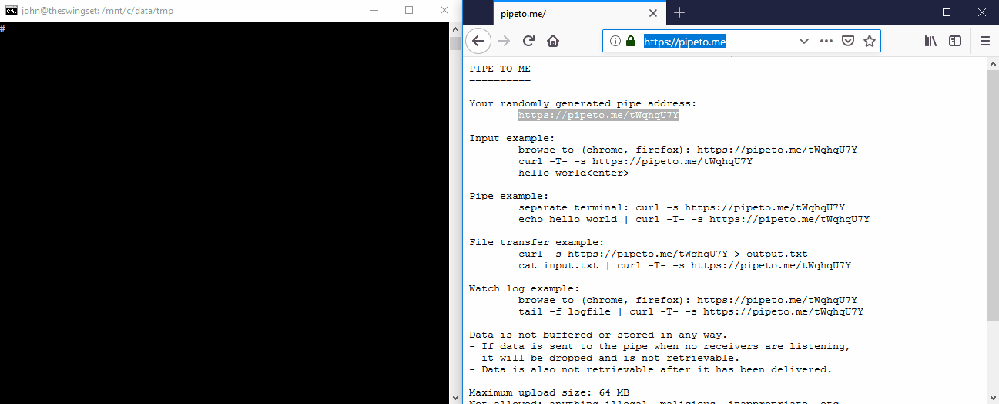

PIPE TO ME
==========

Stream data over http using curl.  Hosted at [pipeto.me](https://pipeto.me/)



```
Your randomly generated pipe address:
	https://<host>/<key>
Read from the pipe:
	curl -s https://<host>/<key>
Send to the pipe:
	curl -T- -s https://<host>/<key>
	<type input>

Data is not buffered or stored in any way.
If data is sent to the pipe when no receivers are listening, 
it will be dropped and is not retrievable.
Data is also not retrievable after it has been delivered.

Maximum upload size: 64 MB
Not allowed: anything illegal, malicious, inappropriate, private, or nsfw 
Source: https://github.com/jpschroeder/pipe-to-me

File transfer example:
	curl -s https://<host>/<key> > output.txt
	cat input.txt | curl -T- -s https://<host>/<key>
```

## Installation

With go installed:
```shell
go get -u github.com/jpschroeder/pipe-to-me
```

## Usage

```shell
pipe-to-me -h
  -baseurl string
        the base url of the service
         (default "http://localhost:8080/")
  -httpaddr string
        the address/port to listen on for http
        use :<port> to listen on all addresses
         (default "localhost:8080")
```

## Building

In order to build the project, just use:
```shell
go build
```

## Deploying

You can build the project under linux (or Windows Subsystem for Linux) and just copy the executable to your server.

You can then run the program directly or use systemd to install it as a service and keep it running.

Customize the `pipe-to-me.service` file in the repo for your server and copy it to `/lib/systemd/system/pipe-to-me.service` (ubuntu)

Start the app with: `systemctl start pipe-to-me`  
Enable it on boot with: `systemctl enable pipe-to-me`  
Check it's status with: `systemctl status pipe-to-me`  
See standard output/error with: `journalctl -f -u pipe-to-me`

### NGINX

You can host the application using go directly, or you can listen on a local port and use nginx to proxy connections to the app.

Make sure that nginx is installed with: `apt-get install nginx`

Customize `pipe-to-me.nginx.conf` and copy it to `/etc/nginx/sites-available/pipe-to-me.nginx.conf`

Remove the default website configuration: `rm /etc/nginx/sites-enabled/default`

Enable the go proxy: `ln -s /etc/nginx/sites-available/pipe-to-me.nginx.conf /etc/nginx/sites-enabled/pipe-to-me.nginx.conf`

Restart nginx to pick up the changes: `systemctl restart nginx`

### NGINX HTTPS

If running as a stand-alone go application, you can use the built-in https support.  When running behind a proxy, you should enable https in nginx and forward to the localhost http address.

Install the letsencrypt client with: 

```shell
add-apt-repository ppa:certbot/certbot
apt-get install python-certbot-nginx
```

Generate and install a certificate with: `certbot --nginx -d pipeto.me`

The certificate should auto-renew when necessary.
